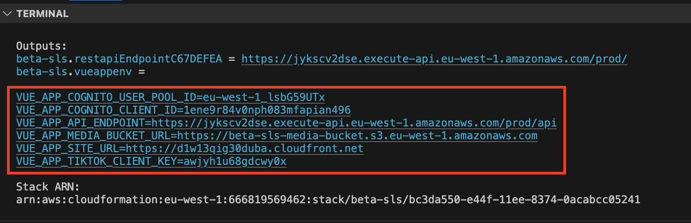

# <div id="top"></div>

## 目次

1. [環境](#環境)
3. [開発環境構築](#開発環境構築)
4. [テスト環境のデプロイ方法](#テスト環境のデプロイ方法)


## 環境

| 言語・フレームワーク      | バージョン  |
| --------------------- | ---------- |
| Vue.js                | 18.2.0     |
| Node.js               | 16.17.0    |
| PostgreSQL            | ^8.11.3    |
| CDK                   | 1.3.6      |


| 主な AWS サービス       | バージョン   |
| --------------------- | ---------- |
| Aurora PostgreSQL     |  16.1      |
| S3                    |            |
| Cognito User Pool　　　|            |
| API Gateway           |            |
| Lambda                |            |


その他のパッケージのバージョンは package.json を参照してください

## 開発環境構築

CDK CLI と Node.js v18 以降をお使いのマシンにインストールする必要があります。

### テスト環境のデプロイ方法

以下の3ステップで backend と frontend のデプロイが完了します。

3つ目のステップは、初めてデプロイする際のみ必要です。2度目以降は行う必要がありません。

#### ステップ 1

ターミナルで frontend ディレクトリに移動し、以下のコマンドを実行してください。
(`npm i` コマンドで パッケージはインストールされた状態を前提としています)

```
npm run build
```

#### ステップ 2

ルートフォルダにある .env ファイルを以下の環境変数例と[環境変数の一覧](#環境変数の一覧)を元に作成します。


```shell
#-------------------------------------------------------------------
# CDK 共通
#-------------------------------------------------------------------
AWS_ACCOUNT=1234567890
AWS_REGION=eu-west-1
AWS_STAGE=test
APP_NAME=myapp

#-------------------------------------------------------------------
# データベース用
#-------------------------------------------------------------------
DB_USER=examplename
DB_PASSWORD=examplepassword
DB_NAME=exampledbname
ENCRYPTION_KEY_STRING=example1234567890IlJ1x1s6yH1cox7oBMAXDxWeU4=

#-------------------------------------------------------------------
# TikTokクライアント用
#-------------------------------------------------------------------
TIKTOK_CLIENT_KEY=exampleclientkey
TIKTOK_CLIENT_SECRET=exampleclientsecret
TIKTOK_CLIENT_AUDITED=false
```

.env ファイルを作成後、ルートディレクトリに移動し、以下のコマンドで開発環境をデプロイします。
（`npm i` コマンドでパッケージはインストールされた状態を前提としています）

```
npm run deploy:dev
```

> このコマンドは、デプロイする AWS アカウントの認証情報が default として .aws/credentials に設定されていることを前提としています。
> 認証情報が default 意外に保管されている場合は、それに応じて package.json ファイルの script -> deploy:dev -> --profile パラメータをを変更するか、もしくは `AWS_ACCESS_KEY_ID` と `AWS_SECRET_ACCESS_KEY` を .env に直接書き込んでください。
> アカウントの認証情報設定方法：https://docs.aws.amazon.com/ja_jp/cli/latest/userguide/cli-configure-files.html#cli-configure-files-methods


#### ステップ 3

ステップ 2 完了後のコマンドアウトプットに含まれている vueappenv の値をすべてコピーし、frontend/.env に貼り付けてください。
以下のような環境変数となります。

```shell
VUE_APP_COGNITO_USER_POOL_ID=eu-west-1_123example  
VUE_APP_COGNITO_CLIENT_ID=example23rui3asldjfblasie  
VUE_APP_API_ENDPOINT=https://example.execute-api.eu-west-1.amazonaws.com/prod/  
VUE_APP_MEDIA_BUCKET_URL=https://example-media-bucket.s3.eu-west-1.amazonaws.com  
VUE_APP_SITE_URL=https://example.cloudfront.net  
VUE_APP_TIKTOK_CLIENT_KEY=exampleClientKey2384
```

;

frontend/.env ファイルを作成後、frontend ディレクトリに移動し、以下のコマンドでフロントエンドをビルドします。

```
npm run build
```

ビルドが完了したら、ルートディレクトリから以下のコマンドで開発環境を再デプロイします。

```
npm run deploy:dev
```


### 動作確認

`npm run deploy:dev` コマンドが完了しましたら、アウトプットに含まれている VUE_APP_SITE_URL のURLにアクセスできるか確認します。

フロントエンドにアクセスできたら成功です。

### 環境変数の一覧

#### /.env

| 変数名                  | 例                                                 | 役割                                                 |
| ---------------------- | --------------------------------------------------- | --------------------------------------------------- |
| AWS_ACCOUNT            | 1234567890                                          | AWS アカウントの一意の識別子                         |
| AWS_REGION             | eu-west-1                                           | アプリケーションをデプロイする AWS リージョン        |
| AWS_STAGE              | dev, prod 等                                        | CDKが作成する全てのリソース名に、APP_NAME と共に接頭辞として使用されます   |
| APP_NAME               | myapp                                               | CDKが作成する全てのリソース名に、AWS_STAGE と共に接頭辞として使用されます |
| DB_NAME                | myapp                                               | デフォルトで作成されるデータベース名前               |
| DB_USER                | examplename                                         | デフォルトで作成されるデータベースのマスターユーザー名 |
| DB_PASSWORD            | examplepassword                                     | デフォルトで作成されるデータベースのマスターパスワード |
| ENCRYPTION_KEY_STRING  | example1234567890IlJ1x1s6yH1cox7oBMAXDxWeU4=        | 標準の8ビットASCIIエンコーディングを各文字に使用する場合、32文字(256-bit) のランダムな文字列を使用してください |
| TIKTOK_CLIENT_KEY      | exampleclientkey                                    | TikTok API へのアクセスに使用されるクライアントキー |
| TIKTOK_CLIENT_SECRET   | exampleclientsecret                                 | TikTok API へのアクセスに使用されるクライアントシークレット |
| TIKTOK_CLIENT_AUDITED  | false                                               | 未監査クライアントからアップロードされたすべてのコンテンツはプライベート表示モードに制限されます。監査を受け、通った後以下の環境変数を true にすると、TikTokへ一般公開モードで投稿します。参照: https://developers.tiktok.com/doc/content-sharing-guidelines/  |


#### /frontend/.env

フロントエンドの 環境変数は　`npm run deploy:dev` コマンド完了時に Output として自動的に生成されます。

| 変数名                     | 例                                                 | 役割                                                |
| ------------------------- | --------------------------------------------------- | --------------------------------------------------- |
| VUE_APP_COGNITO_USER_POOL_ID | eu-west-1_example                                | Cognito ユーザープールの一意の識別子             |
| VUE_APP_COGNITO_CLIENT_ID | example0nph083mfapian496                            | Cognito クライアントの一意の識別子                |
| VUE_APP_API_ENDPOINT      | https://example.execute-api.eu-west-1.amazonaws.com/prod/api | アプリケーションのバックエンド API のエンドポイント |
| VUE_APP_MEDIA_BUCKET_URL  | https://example-media-bucket.s3.eu-west-1.amazonaws.com | アプリケーションで使用するメディアバケットの URL    |
| VUE_APP_SITE_URL          | https://example.cloudfront.net               | アプリケーションのホストされているサイトの URL     |
| VUE_APP_TIKTOK_CLIENT_KEY | example68gdcwy0x                                    | TikTok API へのアクセスに使用されるクライアントキー |


<p align="right">(<a href="#top">トップへ</a>)</p>
