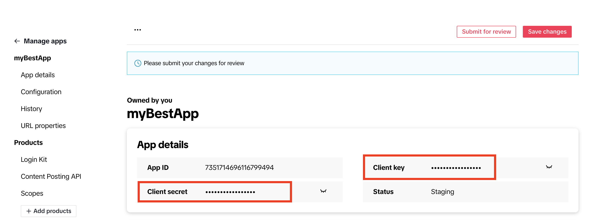

# <div id="top">開発者用ガイド</div>

## **目次**

1. <a href="#1-0">環境</a>

2. <a href="#2-0">開発環境のデプロイ方法</a>
    - <a href="#2-1">ステップ 1: フロントエンドをコンパイルする</a>
    - <a href="#2-2">ステップ 2: 全てのスタックををデプロイする</a>
    - <a href="#2-3">ステップ 3: フロントエンドとバックエンドのリソースを Sync する</a>
    - <a href="#2-4">ステップ 4: テーブルを作成する</a>
    - <a href="#2-5">環境変数の一覧</a>

3. <a href="#3-0">コード変更をローカル/開発環境に反映させる方法と注意点</a>
    - <a href="#3-1">フロントエンド: ローカル環境</a>
    - <a href="#3-2">フロントエンド: AWS上での開発環境</a>
    - <a href="#3-3">インフラ/バックエンド: ローカル環境</a>
    - <a href="#3-4">インフラ/バックエンド: AWS上での開発環境</a>

4. <a href="#4-0">TikTokクライアントの設定と API利用の申請方法</a>    
    - <a href="#4-1">1. TikTok Developer アカウントを開設する</a>    
    - <a href="#4-2">2. App を作成する</a>    
    - <a href="#4-3">3. Configuration セクションの必要事項を記入する</a>    
    - <a href="#4-4">4. URL properties セクションの必要事項を記入する</a>    
    - <a href="#4-5">5. Products を追加・設定する</a>    
    - <a href="#4-6">6. Login Kit の必要事項を記入する</a>    
    - <a href="#4-7">7. Content Posting API の必要事項を設定する</a>    
    - <a href="#4-8">8. Scopes の必要事項を確認する</a>    
    - <a href="#4-9">9. API利用の申請をする</a>    
    - <a href="#4-10">10. TikTokログインの動作確認をする</a>    
  
---

<div id="1-0"></div>

## **環境**

| 言語・フレームワーク      | バージョン  |
| --------------------- | ---------- |
| Vue.js                | ^3.4.21    |
| Node.js               | ^18.0.0    |
| PostgreSQL            | ^8.11.3    |
| AWS CDK               | ^2.129.0   |
| AWS SDK               | ^3.521.0   |

| 主な AWS サービス       | バージョン   |
| --------------------- | ---------- |
| Aurora PostgreSQL     |  16.1      |
| S3                    |            |
| Cognito User Pool　　　|            |
| API Gateway           |            |
| Lambda                |            |

その他のパッケージのバージョンは package.json を参照してください


<div id="2-0"></div>

## **開発環境のデプロイ方法**

> CDK CLI と Node.js v18 以降をお使いのマシンにインストールする必要があります。

以下の3ステップで backend と frontend のデプロイが完了します。

*ステップ 3 と 4 は、初めてデプロイする際のみ必要です。2度目以降は行う必要がありません。*


<div id="2-1"></div>

### **ステップ 1: フロントエンドをコンパイルする**

ターミナルで **frontend ディレクトリ**に移動し、以下のコマンドを実行してください。

> `npm i` コマンドで パッケージはインストールされた状態を前提としています

```
npm run build
```


<div id="2-2"></div>

### **ステップ 2: 全てのスタックををデプロイする**

**ルートディレクトリ**にある **.env** ファイルを以下の環境変数例と[環境変数の一覧](#環境変数の一覧)を元に作成します。


```shell
#-------------------------------------------------------------------
# CDK 共通
#-------------------------------------------------------------------
AWS_ACCOUNT=1234567890
AWS_REGION=eu-west-1
AWS_STAGE=test
APP_NAME=myapp

#-------------------------------------------------------------------
# データベース用
#-------------------------------------------------------------------
DB_USER=examplename
DB_PASSWORD=examplepassword
DB_NAME=exampledbname
ENCRYPTION_KEY_STRING=example1234567890IlJ1x1s6yH1cox7oBMAXDxWeU4=

#-------------------------------------------------------------------
# TikTokクライアント用
#-------------------------------------------------------------------
TIKTOK_CLIENT_KEY=exampleclientkey
TIKTOK_CLIENT_SECRET=exampleclientsecret
TIKTOK_CLIENT_AUDITED=false
```

.env ファイルを作成後、**ルートディレクトリ**に移動し、以下のコマンドで開発環境をデプロイします。

> 注1: `npm i` コマンドでパッケージはインストールされた状態を前提としています。

> 注2: 指定のアカウント・リージョン上での CDKによるデプロイが初めての場合、CDK bootstrap が先に必要となります。`npm run bootstap` コマンドでブートストラップを実行してから、以下のコマンドでデプロイしてください。
> ブートストラップが必要になるのは 各アカウントの各リージョンで一度きりですので、2度目以降のデプロイではスキップしていただけます。

```
npm run deploy:dev
```

*このコマンドは、デプロイする AWS アカウントの認証情報が default として .aws/credentials に設定されていることを前提としています。*     
*認証情報が default 意外に保管されている場合は、それに応じて package.json ファイルの script -> deploy:dev -> --profile パラメータをを変更するか、もしくは `AWS_ACCESS_KEY_ID` と `AWS_SECRET_ACCESS_KEY` を .env に直接書き込んでください。*    

*参照: [アカウントの認証情報設定方法](https://docs.aws.amazon.com/ja_jp/cli/latest/userguide/cli-configure-files.html#cli-configure-files-methods)*

<div id="2-3"></div>

### **ステップ 3: フロントエンドとバックエンドのリソースを Sync する**

> このステップは、初めてデプロイする際のみ必要です。2度目以降は行う必要がありません。

ステップ 2 完了後のコマンドアウトプットに含まれている vueappenv の値をすべてコピーし、**frontend/.env** に貼り付けてください。

以下のような環境変数となります。

```shell
VUE_APP_COGNITO_USER_POOL_ID=eu-west-1_123example  
VUE_APP_COGNITO_CLIENT_ID=example23rui3asldjfblasie  
VUE_APP_API_ENDPOINT=https://example.execute-api.eu-west-1.amazonaws.com/prod/api 
VUE_APP_MEDIA_BUCKET_URL=https://example-media-bucket.s3.eu-west-1.amazonaws.com  
VUE_APP_SITE_URL=https://example.cloudfront.net  
VUE_APP_TIKTOK_CLIENT_KEY=exampleClientKey2384
```


frontend/.env ファイルを作成後、**frontend ディレクトリ**に移動し、以下のコマンドでフロントエンドをビルドします。

```
npm run build
```

ビルドが完了したら、**ルートディレクトリ**から以下のコマンドで開発環境を再デプロイします。

```
npm run deploy:dev
```

#### **動作確認**

`npm run deploy:dev` コマンドが完了しましたら、アウトプットに含まれている **VUE_APP_SITE_URL** のURLにアクセスできるか確認します。フロントエンドにアクセスできたら成功です。


<div id="2-4"></div>

### **ステップ 4: テーブルを作成する**

> このステップは、初めてデプロイする際のみ必要です。2度目以降は行う必要がありません。

> 1回目のデプロイの場合、この時点ではまだ 必要なテーブルは作成されていません。以下の手順でテーブルを作成してください。

1. UIからユーザーとしてログインした際「**投稿管理画面**」等でエラーメッセージが表示されることを確認します。

2. AWSコンソールにログインし、Lambdaのページに移動します。

3. **`create-table`** で関数を検索し、関数名が **`<AWS_STAGE 環境変数>-<APP_NAME 環境変数>-create-table`** のものを選択します。

4. テストタブに移動し、「**テスト**」のボタンをクリックします。

5. 実行が完了しましたら、タブの下に `実行中の関数: 成功` が表示されます。「**詳細**」をひらいて「**テーブルが作成されました**」と表示されていれば、テーブル作成成功です。

6. フロントエンドにアクセスし、ユーザーとしてログインします。エラーが表示されないことを確認します。

<div id="2-5"></div>

### **環境変数の一覧**

#### /.env

| 変数名                  | 例                                                 | 役割                                                 |
| ---------------------- | --------------------------------------------------- | --------------------------------------------------- |
| AWS_ACCOUNT            | 1234567890                                          | AWS アカウントの一意の識別子                         |
| AWS_REGION             | eu-west-1                                           | アプリケーションをデプロイする AWS リージョン        |
| AWS_STAGE              | dev, prod 等                                        | CDKが作成する全てのリソース名に、APP_NAME と共に接頭辞として使用されます   |
| APP_NAME               | myapp                                               | CDKが作成する全てのリソース名に、AWS_STAGE と共に接頭辞として使用されます |
| DB_NAME                | myapp                                               | デフォルトで作成されるデータベース名前               |
| DB_USER                | examplename                                         | デフォルトで作成されるデータベースのマスターユーザー名 |
| DB_PASSWORD            | examplepassword                                     | デフォルトで作成されるデータベースのマスターパスワード |
| ENCRYPTION_KEY_STRING  | example1234567890IlJ1x1s6yH1cox7oBMAXDxWeU4=        | 標準の8ビットASCIIエンコーディングを各文字に使用する場合、32文字(256-bit) のランダムな文字列を使用してください |
| TIKTOK_CLIENT_KEY      | exampleclientkey                                    | TikTok API へのアクセスに使用されるクライアントキー / <a href="#Appを作成する">Appを作成する</a> から作成したアプリのページから取得できます。まだ作成されていない場合、ダミーの値を記入します |
| TIKTOK_CLIENT_SECRET   | exampleclientsecret                                 | TikTok API へのアクセスに使用されるクライアントシークレット / <a href="#Appを作成する">Appを作成する</a> から作成したアプリのページから取得できます。まだ作成されていない場合、ダミーの値を記入します　|
| TIKTOK_CLIENT_AUDITED  | false                                               | 未監査クライアントからアップロードされたすべてのコンテンツはプライベート表示モードに制限されます。監査を受け、通った後以下の環境変数を true にすると、TikTokへ一般公開モードで投稿します。参照: https://developers.tiktok.com/doc/content-sharing-guidelines/  |


#### /frontend/.env

フロントエンドの 環境変数は　`npm run deploy:dev` コマンド完了時に Output として自動的に生成されます。

| 変数名                        | 例                                                  | 役割                                                |
| ---------------------------- | --------------------------------------------------- | --------------------------------------------------- |
| VUE_APP_COGNITO_USER_POOL_ID | eu-west-1_example                                   | Cognito ユーザープールの一意の識別子             |
| VUE_APP_COGNITO_CLIENT_ID    | example0nph083mfapian496                            | Cognito クライアントの一意の識別子                |
| VUE_APP_API_ENDPOINT         | https://example.execute-api.eu-west-1.amazonaws.com/prod/api | アプリケーションのバックエンド API のエンドポイント |
| VUE_APP_MEDIA_BUCKET_URL     | https://example-media-bucket.s3.eu-west-1.amazonaws.com | アプリケーションで使用するメディアバケットの URL    |
| VUE_APP_SITE_URL             | https://example.cloudfront.net                      | アプリケーションのホストされているサイトの URL     |
| VUE_APP_TIKTOK_CLIENT_KEY    | example68gdcwy0x                                    | TikTok API へのアクセスに使用されるクライアントキー |


<p align="right">(<a href="#top">トップへ</a>)</p>

---

<div id="3-0"></div>

## **コード変更をローカル/開発環境に反映させる方法と注意点**

コード変更を開発環境にデプロイしてテストをする場合、以下の手順で変更を反映させることができます。

<div id="3-1"></div>

### **フロントエンド: ローカル環境**

フロントエンドの変更はローカル環境でテストが可能です。**frontend** ディレクトリへ移動し `npm run serve` コマンドを実行してください。

ポートが利用可能であれば https://localhost:8080 にUIのサーバーが実行されます。

<div id="3-2"></div>

### **フロントエンド: AWS上での開発環境**

フロントエンドの変更をAWS上にアップロードする場合は、再ビルドと再デプロイが必要になります。

手順は、**frontend** のディレクトリで `npm run build` を実行したあと、**ルート**ディレクトリから `npm run deploy:dev` コマンドを実行します。

> UIの変更を再デプロイした際、CloudFrontのキャッシュ機能によって変更が反映されない場合が多々あります。
> そういった場合は、CloudFront コンソールにアクセスし、ディストリビューションのページからキャッシュをクリアする必要があります。
> ディストリビューションから該当のIDを選択し、キャッシュ削除タブへ移動します。 [キャッシュ削除を作成] をクリックしますと オブジェクトパスが追加できますので、__/*__ を追加しキャッシュ削除を作成してください。

<div id="3-3"></div>

### **インフラ/バックエンド: ローカル環境**

サーバーレスアプリケーションをローカル環境でテストするためには、いくつかのツールを利用して環境を整備する必要があります。

こちらの記事が参考になります:　[サーバーレスのローカル開発環境を整備する](https://aws.amazon.com/jp/builders-flash/202303/serverless-local-dev-environment)

<div id="3-4"></div>

### **インフラ/バックエンド: AWS上での開発環境**

ローカル環境でテストするための整備が厄介な場合や、上記の設備でもテストできない範囲がある場合、AWSの開発環境に変更をデプロイしてテストをします。

1度目のデプロイでない限り、`npm run deploy:dev` のコマンドのみでバックエンドの変更はAWS上に反映されます。<a href="#2-0">1度目のデプロイの場合はこちら</a>

> おすすめツール（VS Code をお使いの場合のみ該当）:　VS Code 拡張機能の「AWS Toolkit」を利用すると、エディタとAWSコンソールの面倒な行き来を無くせます

---

<div id="4-0"></div>

## **TikTokクライアントの設定と API利用の申請方法**

以下の手順は、TikTok API を利用するために必要な設定をする方法です。

> サイトが既にデプロイされている状態を前提とします。


<div id="4-1"></div>

### **1. TikTok Developer アカウントを開設する**

こちらの [新規登録ページ](https://developers.tiktok.com/signup) から アカウントを開設します。

参照ブログ: [TikTok for Developersアカウント作成方法](https://nfr-log.com/how-to_create_tiktokfordevelopers/#index_id6:~:text=%E3%81%84%E3%81%84%E3%81%A7%E3%81%97%E3%82%87%E3%81%86%E3%80%82-,TikTok%20for%20Developers%E3%82%A2%E3%82%AB%E3%82%A6%E3%83%B3%E3%83%88%E4%BD%9C%E6%88%90%E6%96%B9%E6%B3%95,-%E3%83%A1%E3%83%BC%E3%83%AB%E3%82%A2%E3%83%89%E3%83%AC%E3%82%B9%E3%81%AE%E7%99%BB%E9%8C%B2)

<div id="4-2"></div>

### **2. App を作成する**

開設したアカウントにログインし、メニューから [Manage Apps](https://developers.tiktok.com/apps/) ページへ移動します。

Manage Apps ページから、`Connect an app` ボタンを選択します。


必要事項を記入後 `Confirm` を選択し、App を作成します。

App が作成されたページ (以後このページを App ページとします) から クライアントキーとクライアントシークレットが取得できます。




<div id="4-3"></div>

### **3. Configuration セクションの必要事項を記入する**

1. `App icon`, `App name`, `Category`, `Description` を記入します。   

2. `Terms of Service URL` へは、サイトの利用規約ページを記入します。(ページが存在する場合、デプロイされたサイトのページを参照します。例: `<VUE_APP_SITE_URL の変数>/terms` 等)   

3. `Privacy Policy URL ` へは、サイトのプライバシーポリシーページを記入します。(ページが存在する場合、デプロイされたサイトのページを参照します。例: `<VUE_APP_SITE_URL の変数>/policy` 等)    

4. `Platforms` セクションの `Configure for Web` を選択し、`Website URL` へは、サイトの概要がわかるページを参照します。(ページが存在する場合、デプロイされたサイトのページ (`VUE_APP_SITE_URL` の変数) を記入できるかと思いますが、もしトップページがログインページ（サイトの概要がわからない）の場合 審査に落ちてしまうかもしれません。)   

> もしページが存在しない・サイトのトップがログインページの場合、適当な個人所有するサイトなどを参照するのが最良かと思います。


<div id="4-4"></div>

### **4. URL properties セクションの必要事項を記入する**

URL properties の設定は、動画や画像をS3バケット経由で投稿するため必要になります。

1. `Verify Property` を選択します。

2. `Select property type` から `URL prefix` を選択し、`Continue` を選択します。`Enter URL prefix` モーダルが表示されます。


3. `URL prefix` のフォームに、デプロイされた メディアバケット (`VUE_APP_MEDIA_BUCKET_URL` の変数) を記入します。URLの最後に `/` が必要になります。`Continue` を選択すると、`Verify URL prefix via signature file Upload` モーダルが表示されます。


4.  `Verify URL prefix via signature file Upload` の手順に沿って、表示されたファイルをダウンロードします。

5. ダウンロードしたファイルをメディアバケットにアップロードし、app ページに戻り モーダルの `Verify` ボタンを選択します。


<div id="4-5"></div>

### **5. Products を追加・設定する**

APIを使ってユーザーのアカウントへ投稿をするためには、`Login Kit`, `Content Posting API`, `Scopes` のプロダクト利用が必要になります。以下の手順でこの3つのプロダクトを設定します。

App ページ のメニューから `Add Products` を選択し、前述の 3つのプロダクトの `Add` ボタンから追加します。


追加が完了すると、app のメニューに `Products` セクションが表示されます。


<div id="4-6"></div>

### **6. Login Kit の必要事項を記入する**

`Login Kit` の `Redirect URI` セクションから `Web` を選択し、デプロイされたサイトのTikTokリダイレクトURL `<VUE_APP_SITE_URL>/tiktok-redirect` を記入します。

例:

```
https://example.cloudfront.net/tiktok-redirect
```


<div id="4-7"></div>

### **7. Content Posting API の必要事項を設定する**

`Content Posting API` セクションの `Direct Post` のトグルボタンをオンにします。


<div id="4-8"></div>

### **8. Scopes の必要事項を確認する**
 
`Scopes` セクションに `user.info.basic` と `video.publish` のスコープが追加されていることを確認します。この時点では、スコープは `Submit for review` のステータスになっていることを確認します。


<div id="4-9"></div>

### **9. API利用の申請をする**

App ページのトップにある `Submit for review` ボタンを選択し、申請を完了します。


<div id="4-10"></div>

### **10. TikTokログインの動作確認をする**

申請が通ったら、利用者のアクセストークンを取得する際に必要な TikTok でのログインが可能となります。

サイトにユーザーとしてログインし、`<VUE_APP_SITE_URL の変数>/tiktok/account` ページの `TikTok ログイン` ボタンからTikTokユーザーとしてログインできることを確認します。


<p align="right">(<a href="#top">トップへ</a>)</p>

